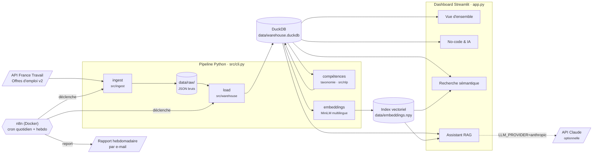

# Radar Tech FR

[](https://github.com/AndresRocabado/radar-tech-fr/actions/workflows/tests.yml)

**Quelles compétences data, IA et no-code les entreprises françaises recrutent-elles vraiment, et où ?**
Un observatoire construit sur 2 789 offres réelles de l'API France Travail, mis à jour automatiquement.

**[Voir la démo en ligne](https://radar-tech-fr.streamlit.app/)** : sans inscription, sans installation.


## Le problème

Un candidat en alternance, une école ou un recruteur n'a pas de vue chiffrée des compétences tech demandées en France : les offres sont dispersées et rédigées en texte libre.
Radar Tech FR collecte ces offres, en extrait les compétences, puis permet de comparer volumes, salaires, régions et alternance, et de poser des questions en langage naturel.
Chaque lundi, un rapport signale les compétences en forte hausse.

## Architecture



## Choix techniques

| Choix | Pourquoi |
|---|---|
| **DuckDB** plutôt que PostgreSQL | L'analyse porte sur quelques milliers d'offres en lecture seule : une base analytique embarquée dans un fichier suffit, sans serveur à administrer. Le fichier est versionné, donc la démo en ligne fonctionne dès le `git clone` ([ADR 0005](docs/adr/0005-duckdb-plutot-que-postgresql.md)). |
| **Streamlit** | Un dashboard multipage en Python pur, sans front-end séparé à maintenant pour un projet mené seul. L'hébergement gratuit sur Streamlit Community Cloud fournit une démo publique sans infrastructure ([ADR 0006](docs/adr/0006-streamlit-pour-le-dashboard.md)). |
| **`paraphrase-multilingual-MiniLM-L12-v2`** | Les offres sont en français et les requêtes parfois en anglais : il faut un modèle multilingue. À 384 dimensions, il tourne sur CPU, dans les limites de mémoire de l'hébergement gratuit ([ADR 0007](docs/adr/0007-modele-d-embeddings.md)). |
| **n8n** | La planification et l'envoi d'e-mails se configurent visuellement, sans code d'orchestration à écrire. n8n ne fait qu'appeler la ligne de commande Python, qui reste testée et utilisable à la main ([ADR 0004](docs/adr/0004-python-dans-l-image-n8n.md)). |

Autres décisions documentées : [recherche vectorielle en numpy](docs/adr/0001-recherche-vectorielle-numpy.md), [assistant aux chiffres comptés en SQL](docs/adr/0002-assistant-rag-chiffres-sql.md), [données versionnées](docs/adr/0003-donnees-versionnees-dans-le-depot.md).

## Lancer en local

Python 3.12 ou plus récent.

```bash
git clone https://github.com/AndresRocabado/radar-tech-fr && cd radar-tech-fr
python -m venv .venv && source .venv/bin/activate    # Windows : .venv\Scripts\activate
pip install -r requirements.txt
streamlit run app.py
```

Aucune clé n'est nécessaire : l'entrepôt est fourni et l'assistant tourne en mode hors ligne.
Pour collecter de nouvelles offres, copier `.env.example` en `.env`, installer `requirements-dev.txt` et lancer `python -m src.cli ingest` puis `load`.
L'automatisation n8n est décrite dans [docs/automatisation.md](docs/automatisation.md).
Les tests se lancent avec `pytest`, après `pip install -r requirements-dev.txt`.

> `python -m src.cli load` reconstruit l'entrepôt depuis `data/raw/`, qui n'est pas versionné.
> Sans page brute, la commande s'arrête avec une erreur plutôt que de vider `data/warehouse.duckdb` : collectez d'abord avec `ingest`.

## Limites connues

- **Une seule source.** France Travail ne couvre pas LinkedIn, Welcome to the Jungle ni les sites carrières : les startups et les grands groupes tech y sont sous-représentés.
- **L'historique est court.** Il n'existe qu'une collecte ponctuelle, et l'API ne renvoie plus les offres retirées : les semaines anciennes sont sous-représentées, et les seuils du rapport restent à recalibrer.
- **L'extraction de compétences repose sur une taxonomie fermée** de 110 compétences. Une technologie absente de la liste reste invisible.
- **L'assistant de la démo ne rédige pas** : il affiche les statistiques SQL qu'un LLM recevrait, pour éviter une clé publique et des coûts. La rédaction exige `LLM_PROVIDER=anthropic`.
- **L'index vectoriel n'est pas recalculé par n8n** (torch est absent de l'image Docker), il faut le reconstruire à la main.

## Avec plus de temps

- Ajouter d'autres sources et dédoublonner les offres entre elles.
- Accumuler plusieurs mois de collecte quotidienne pour publier de vraies tendances.
- Compléter la taxonomie par une extraction de compétences par NER, afin de détecter les technologies émergentes.
- Séparer le pipeline dans un conteneur de travail et ajouter une CI GitHub Actions (tests et reconstruction des données).

