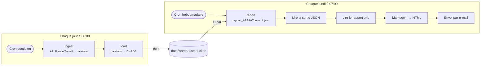

# Automatisation avec n8n

La collecte, la reconstruction de l'entrepôt et le rapport hebdomadaire
tournent seuls, orchestrés par n8n en local. n8n ne calcule rien : chaque étape
appelle la ligne de commande du projet, `src/cli.py`. Le choix de faire
tourner Python dans l'image n8n est expliqué dans
[l'ADR 0004](adr/0004-python-dans-l-image-n8n.md).


## Le workflow

Un seul workflow, deux déclencheurs. Les deux branches ne sont pas reliées par
une flèche mais par l'entrepôt : la branche quotidienne l'alimente, la branche
hebdomadaire le lit.



| Nœud n8n | Type | Ce qu'il fait |
|---|---|---|
| Cron quotidien | Schedule Trigger | `0 6 * * *`, heure de Paris |
| Ingest | Execute Command | `python -m src.cli ingest` : un appel par mot-clé de `config/queries.yaml`, pages brutes dans `data/raw/` |
| Load | Execute Command | `python -m src.cli load` : reconstruit `raw_offres`, la vue `offres` et `offre_competences` |
| Cron hebdomadaire | Schedule Trigger | `0 7 * * 1` : le lundi, une heure après la collecte du jour |
| Report | Execute Command | `python -m src.cli report` : rapport de la dernière semaine complète |
| Lire la sortie | Code | lit la ligne JSON écrite par `report` sur stdout |
| Lire le rapport | Read/Write Files from Disk | ouvre le fichier Markdown indiqué dans cette ligne |
| Extraire le texte | Extract from File | binaire → texte |
| Markdown vers HTML | Markdown | corps de l'e-mail, tableaux compris |
| Envoi par email | Send Email (SMTP) | objet préfixé `[ALERTE xN]` dès qu'une alerte se déclenche |

Si une commande échoue (code de sortie non nul), n8n arrête la branche sur ce
nœud et l'exécution apparaît en erreur dans l'historique : un `load` ne tourne
jamais sur une collecte interrompue.

## Contrat entre n8n et la ligne de commande

Chaque commande écrit **une seule ligne JSON** sur la sortie standard ; les
journaux partent sur la sortie d'erreur. Exemple réel de `report` :

```json
{"semaine": "2026-09-07", "offres": 734, "alertes": 28, "emergentes": 10,
 "objet": "[ALERTE x28] Radar Tech FR — semaine du 07/09/2026",
 "markdown": "/workspace/data/reports/rapport_2026-W37.md",
 "json": "/workspace/data/reports/rapport_2026-W37.json"}
```

Les commandes se lancent aussi à la main, hors de n8n :

```bash
python -m src.cli ingest --dry-run          # liste les recherches, sans appel
python -m src.cli load
python -m src.cli report --week 2026-09-07  # une semaine précise
python -m src.cli report --threshold 30 --min-previous 10  # calibrage
```

## Le rapport hebdomadaire

Il couvre la dernière semaine **complète**, du lundi au dimanche, selon la
date de création des offres, et la compare à la précédente.

- **Nouvelles offres** : nombre d'offres publiées dans la semaine, variation,
  part en alternance.
- **Alertes** : compétences dont la mesure croît de plus de 20 %, parmi celles
  citées par au moins 5 offres la semaine précédente.
- **Compétences émergentes** : sous ce minimum la semaine précédente, en
  hausse, et citées par au moins 3 offres cette semaine.

La mesure par défaut est la **part** des offres de la semaine qui citent la
compétence, et non leur nombre brut. Une collecte ne voit plus les offres déjà
retirées de l'API, si bien que les semaines anciennes sont sous-représentées :
sur la collecte du 18/09, 361 offres pour la semaine du 31/08 contre 734 pour
la suivante. En nombre brut, 46 compétences sur 52 déclencheraient l'alerte.

Tous les seuils se règlent dans la section `rapport` de
`config/queries.yaml`, sans toucher au code.

## Installation

Prérequis : Docker Desktop, et un compte SMTP pour l'envoi (par exemple un
mot de passe d'application Gmail).

1. Compléter `.env` à partir de `.env.example` : identifiants France Travail,
   et `RAPPORT_EMAIL_DE` / `RAPPORT_EMAIL_A`.
2. Construire et démarrer :

   ```bash
   docker compose up -d --build
   ```

3. Ouvrir <http://localhost:5678> et créer le compte propriétaire.
4. Importer le workflow, depuis l'éditeur (*Import from File*) ou en ligne de
   commande :

   ```bash
   docker compose exec n8n n8n import:workflow --input=/workspace/automation/n8n_workflow.json
   ```

5. Créer un identifiant **SMTP** et le sélectionner dans le nœud
   « Envoi par email » : le fichier exporté n'en contient aucun.
6. Tester chaque branche avec *Execute workflow*, puis activer le workflow.

Le volume `n8n_data` conserve workflows, identifiants chiffrés et historique
d'exécution entre deux `docker compose down` / `up`.

## Limites connues

- **Chaque collecte repart de zéro sur 365 jours** : `data/raw/` grossit
  d'environ 40 fichiers par jour. `load` dédoublonne, mais le disque n'est pas
  purgé.
- **L'index vectoriel n'est pas recalculé** par le workflow (`load
  --embeddings` exige torch, absent de l'image). La page « Recherche » signale
  les offres non indexées.
- **Les seuils du rapport sont à recalibrer** une fois quelques semaines de
  collecte quotidienne accumulées : tant que l'entrepôt vient d'une collecte
  unique, les semaines anciennes restent sous-représentées, même en part.
