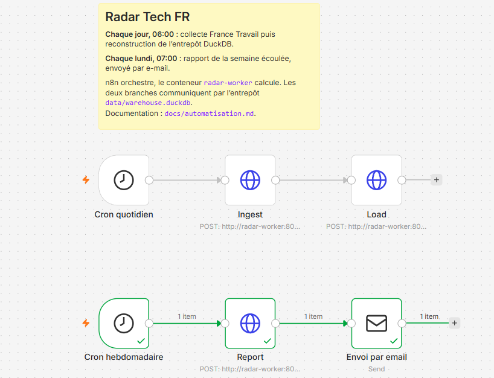
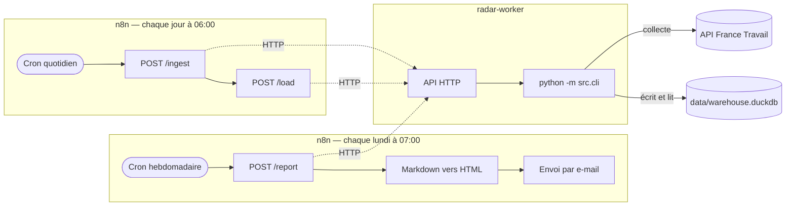

# Automatisation avec n8n

La collecte, la reconstruction de l'entrepôt et le rapport hebdomadaire
tournent seuls, orchestrés par n8n en local. n8n ne calcule rien : il appelle le
conteneur `radar-worker`, qui lance la ligne de commande du projet
(`src/cli.py`). Pourquoi deux conteneurs plutôt que Python dans l'image n8n :
[ADR 0005](adr/0005-conteneur-radar-worker.md), qui révise
l'[ADR 0004](adr/0004-python-dans-l-image-n8n.md).



## Le workflow

Un seul workflow, deux déclencheurs. Les deux branches ne sont pas reliées par
une flèche mais par l'entrepôt : la branche quotidienne l'alimente, la branche
hebdomadaire le lit.


```mermaid
flowchart LR
    subgraph QUOTIDIEN["n8n — chaque jour à 06:00"]
        CQ(["Cron quotidien"]) --> ING["POST /ingest"] --> LOAD["POST /load"]
    end

    subgraph HEBDO["n8n — chaque lundi à 07:00"]
        CH(["Cron hebdomadaire"]) --> REP["POST /report"] --> HTML["Markdown vers HTML"] --> MAIL["Envoi par e-mail"]
    end

    subgraph WORKER["radar-worker"]
        API["API HTTP"] --> CLI["python -m src.cli"]
    end

    FT[("API France Travail")]
    DB[("data/warehouse.duckdb")]

    ING -.->|HTTP| API
    LOAD -.->|HTTP| API
    REP -.->|HTTP| API
    CLI -->|collecte| FT
    CLI -->|écrit et lit| DB
```

| Nœud n8n | Type | Ce qu'il fait |
|---|---|---|
| Cron quotidien | Schedule Trigger | `0 6 * * *`, heure de Paris |
| Ingest | HTTP Request | `POST /ingest` : un appel par mot-clé de `config/queries.yaml`, pages brutes dans `data/raw/`. Délai d'une heure |
| Load | HTTP Request | `POST /load` : reconstruit `raw_offres`, la vue `offres` et `offre_competences` |
| Cron hebdomadaire | Schedule Trigger | `0 7 * * 1` : le lundi, une heure après la collecte du jour |
| Report | HTTP Request | `POST /report` : rapport de la dernière semaine complète, Markdown renvoyé dans la réponse |
| Markdown vers HTML | Markdown | corps de l'e-mail, tableaux compris |
| Envoi par email | Send Email (SMTP) | objet préfixé `[ALERTE xN]` dès qu'une alerte se déclenche |

Si une commande échoue, le worker répond une erreur HTTP, n8n arrête la branche
sur ce nœud et l'exécution apparaît en erreur dans l'historique : un `load` ne
tourne jamais sur une collecte interrompue.

## Le worker

`radar-worker` expose une route par commande. Chacune lance
`python -m src.cli <commande>` en sous-processus et renvoie la ligne JSON que la
commande écrit sur sa sortie standard : la CLI reste le contrat unique, et rien
n'est réimplémenté dans l'API.

| Route | Corps facultatif | Réponse |
|---|---|---|
| `GET /health` | — | `{"statut": "ok"}`, utilisé par le healthcheck |
| `POST /ingest` | `limit`, `max_results`, `dry_run` | nombre d'offres collectées et détail par mot-clé |
| `POST /load` | `embeddings` | offres chargées, compétences extraites |
| `POST /report` | `week`, `threshold`, `min_previous`, `measure` | chiffres du rapport, chemins des fichiers et `contenu_markdown` |

Codes d'erreur : **400** si une option est refusée, **504** au-delà d'une heure,
**500** si la commande échoue — la réponse porte alors les dernières lignes du
journal, ce qui évite d'aller les chercher dans `docker compose logs`.

Les commandes se lancent aussi à la main, sans n8n :

```powershell
docker compose exec radar-worker python -m src.cli report --threshold 30
```

```bash
# ou directement, dans l'environnement de développement
python -m src.cli ingest --dry-run          # liste les recherches, sans appel
python -m src.cli load
python -m src.cli report --week 2026-09-07  # une semaine précise
```

## Le rapport hebdomadaire

Il couvre la dernière semaine **complète**, du lundi au dimanche, selon la
date de création des offres, et la compare à la précédente.

- **Nouvelles offres** : nombre d'offres publiées dans la semaine, variation,
  part en alternance.
- **Alertes** : compétences dont la mesure croît de plus de 20 %, parmi celles
  citées par au moins 5 offres la semaine précédente.
- **Compétences émergentes** : sous ce minimum la semaine précédente, en
  hausse, et citées par au moins 3 offres cette semaine.

La mesure par défaut est la **part** des offres de la semaine qui citent la
compétence, et non leur nombre brut. Une collecte ne voit plus les offres déjà
retirées de l'API, si bien que les semaines anciennes sont sous-représentées :
sur la collecte du 18/09, 361 offres pour la semaine du 31/08 contre 734 pour
la suivante. En nombre brut, 46 compétences sur 52 déclencheraient l'alerte.

Tous les seuils se règlent dans la section `rapport` de
`config/queries.yaml`, sans toucher au code.

## Installation

Prérequis : Docker Desktop, et un compte SMTP pour l'envoi (par exemple un
mot de passe d'application Gmail).

1. Compléter `.env` à partir de `.env.example` : identifiants France Travail,
   et `RAPPORT_EMAIL_DE` / `RAPPORT_EMAIL_A`. Sans ces deux dernières variables,
   `docker compose` refuse de démarrer.
2. Construire et démarrer :

   ```powershell
   docker compose up -d --build
   ```

   Seul `radar-worker` se construit ; n8n attend qu'il soit sain avant de
   démarrer.
3. Vérifier le worker :

   ```powershell
   docker compose exec radar-worker python -m src.cli ingest --dry-run --limit 2
   ```

4. Ouvrir <http://localhost:5678> et créer le compte propriétaire.
5. Importer le workflow, depuis l'éditeur (*Import from File*) ou en ligne de
   commande :

   ```powershell
   docker compose exec n8n n8n import:workflow --input=/import/n8n_workflow.json
   ```

6. Créer un identifiant **SMTP** et le sélectionner dans le nœud
   « Envoi par email » : le fichier exporté n'en contient aucun.
7. Tester chaque branche avec *Execute workflow*, puis activer le workflow.

Le volume `n8n_data` conserve workflows, identifiants chiffrés et historique
d'exécution entre deux `docker compose down` / `up`.

## Limites connues

- **Chaque collecte repart de zéro sur 365 jours** : `data/raw/` grossit
  d'environ 40 fichiers par jour. `load` dédoublonne, mais le disque n'est pas
  purgé.
- **L'index vectoriel n'est pas recalculé** par le workflow : `load
  --embeddings` exige torch, absent de l'image du worker. La page
  « Recherche » signale les offres non indexées.
- **Les seuils du rapport sont à recalibrer** une fois quelques semaines de
  collecte quotidienne accumulées : tant que l'entrepôt vient d'une collecte
  unique, les semaines anciennes restent sous-représentées, même en part.
- **Le worker n'a pas d'authentification** : il n'est joignable que par n8n, sur
  le réseau interne de compose, et aucun port n'est publié sur l'hôte.
- **Une seule commande à la fois** : un unique processus uvicorn sert l'API, et
  deux `load` simultanés se disputeraient l'entrepôt.
